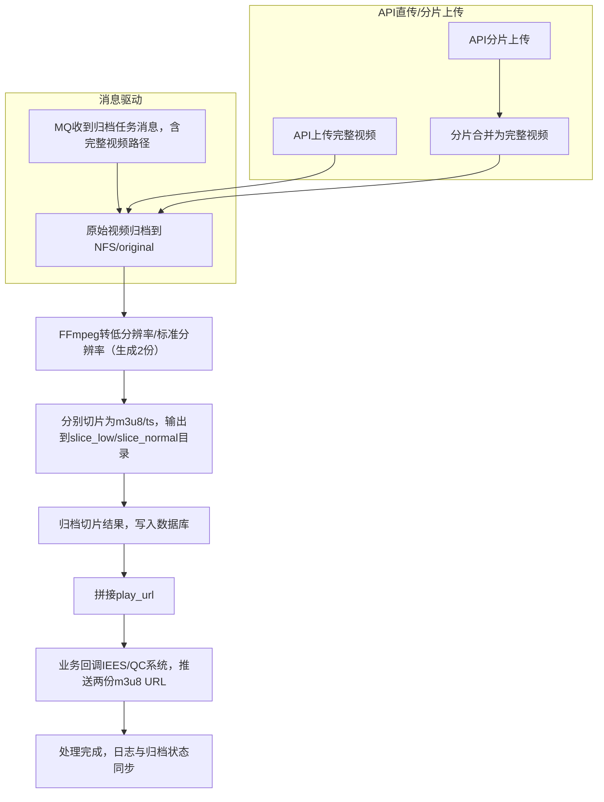

# AGENTS.md

---

## 1. 项目总览

本项目为医疗视频归档处理平台，采用领域驱动设计（DDD）分层，实现分片上传、NFS归档、任务多版本、多来源业务流转、归档产出、异常追溯与运维日志。系统结构简洁，易于维护和扩展。

---

## 2. 目录结构与分层说明

```text
/com/yourcompany/videoproject
    /controller     # API与入口
    /service        # 业务服务编排
    /domain         # 核心领域对象
    /mapper         # Mybatis-Plus持久化接口
    /infra          # MQ、NFS、日志等基础设施
    /util           # 通用工具
```

- `/mapper`：所有实体的`xxxMapper.java`，继承BaseMapper，无须单独Repository层

---

## 3. 技术栈与依赖

- Java 8+、Spring Boot 2.x
- Mybatis-plus
- RabbitMQ
- FFmpeg（基础处理）
- NFS
- MySQL 5.7+
- Logback
- Spring AOP
- Lombok

---

## 4. 接口与规范

- RESTful风格，JSON请求响应
- 上传API带projectNo，支持断点分片
- 多任务/多来源兼容
- 归档、查询、异常、日志均结构化

---

### 5.5 消费消息后的切片与归档流程（修订）

- **MQ消息消费**\
  系统监听MQ队列（如LUX或IEES推送），接收到“完整原始视频路径”及业务参数（项目号、受试者号、访视点、检查日期等）后，自动启动切片与归档处理流程。

- **API两套上传模式**

  - **模式一：完整视频上传**\
    用户直接上传完整视频文件及业务参数，系统立即归档到NFS的`original`目录，写入归档文件表（file\_type=ORIGINAL）。
  - **模式二：分片上传**\
    用户分片上传视频片段，系统合并分片为完整原始视频，归档至NFS后进入后续切片流程。

- **自动视频切片（生成2份）**\
  按业务配置用FFmpeg生成2份（低分/标准分）目标MP4，并分别切片为HLS（m3u8+ts），输出到NFS的`slice_low`、`slice_normal`等目录。

- **归档产出与URL拼接**\
  每生成一个m3u8，自动写入归档文件表（file\_type=M3U8），play\_url直接拼接目录与m3u8名。

- **业务回调（必做）**\
  切片与归档完成后，系统自动回调配置表对应业务系统，推送两份m3u8的URL及归档状态。

- **日志与异常落表**\
  全流程日志和异常落表，支持回溯与自动补偿。

## 6. 数据表结构设计及ER图

### 6.1 项目配置表（project\_config）

| 字段名           | 类型           | 说明         |
| ------------- | ------------ | ---------- |
| id            | bigint       | 主键         |
| project\_no   | varchar(64)  | 项目号，唯一     |
| project\_name | varchar(128) | 项目名称       |
| archive\_root | varchar(256) | NFS归档根目录   |
| is\_active    | tinyint(1)   | 是否启用       |
| ext\_json     | text         | 扩展参数（JSON） |
| create\_time  | datetime     | 创建时间       |
| update\_time  | datetime     | 更新时间       |

---

### 6.2 上传任务主表（video\_upload\_task）

| 字段名              | 类型           | 说明                   |
| ---------------- | ------------ | -------------------- |
| id               | bigint       | 主键                   |
| project\_no      | varchar(64)  | 项目号                  |
| patient\_code    | varchar(64)  | 受试者号                 |
| tp\_stage        | varchar(64)  | 访视点/时间点              |
| uuid             | varchar(64)  | 唯一ID                 |
| version\_no      | int          | 版本号（初始1，业务多批次+1）     |
| source           | varchar(32)  | 来源（controller/mq/其他） |
| status           | varchar(32)  | 任务主状态                |
| main\_file\_name | varchar(256) | 原始文件名                |
| main\_file\_path | varchar(512) | 原始文件NFS路径            |
| file\_size       | bigint       | 原始文件大小               |
| file\_md5        | varchar(64)  | 原始文件MD5              |
| error\_msg       | varchar(512) | 错误/失败信息              |
| create\_time     | datetime     | 创建时间                 |
| update\_time     | datetime     | 更新时间                 |

---

### 6.3 归档文件子表（video\_archive\_file）

| 字段名            | 类型            | 说明                               |
| -------------- | ------------- | -------------------------------- |
| id             | bigint        | 主键                               |
| task\_id       | bigint        | 所属上传任务ID（video\_upload\_task.id） |
| file\_type     | varchar(32)   | M3U8/ORIGINAL/THUMBNAIL等         |
| quality\_level | varchar(32)   | low/high/720p/1080p等             |
| file\_name     | varchar(256)  | 文件名                              |
| file\_path     | varchar(512)  | NFS路径                            |
| play\_url      | varchar(1024) | 播放URL（如有）                        |
| file\_size     | bigint        | 文件大小                             |
| file\_md5      | varchar(64)   | MD5                              |
| status         | varchar(32)   | 状态（active/archived/deleted等）     |
| create\_time   | datetime      | 创建时间                             |
| remark         | varchar(256)  | 备注                               |

---

### 6.4 日志表（task\_log）

| 字段名          | 类型          | 说明                                                    |
| ------------ | ----------- | ----------------------------------------------------- |
| id           | bigint      | 主键                                                    |
| task\_id     | bigint      | 关联上传任务                                                |
| project\_no  | varchar(64) | 项目号                                                   |
| version\_no  | int         | 版本号                                                   |
| log\_type    | varchar(32) | 日志类型（API\_CALL/SERVICE\_OP/MQ\_OP/NFS\_OP/EXCEPTION等） |
| operator     | varchar(64) | 操作人/系统                                                |
| content      | text        | 日志正文                                                  |
| create\_time | datetime    | 日志生成时间                                                |

---

### 6.5 异常/失败追溯表（task\_error）

| 字段名          | 类型            | 说明               |
| ------------ | ------------- | ---------------- |
| id           | bigint        | 主键               |
| task\_id     | bigint        | 关联上传任务           |
| version\_no  | int           | 版本号              |
| error\_type  | varchar(32)   | 异常类型（合并失败/转码失败等） |
| stage        | varchar(32)   | 失败环节（上传/归档等）     |
| error\_code  | varchar(64)   | 错误码/异常编号         |
| error\_msg   | varchar(1024) | 错误详情             |
| operator     | varchar(64)   | 操作人/系统           |
| status       | varchar(32)   | 已处理/未处理/已重试等     |
| create\_time | datetime      | 发生时间             |
| update\_time | datetime      | 状态变更时间           |
| remark       | varchar(256)  | 备注               |

---

### 6.6 表关系与ER图

```
project_config (1) <---- (N) video_upload_task (1) <---- (N) video_archive_file
                                                  |
                                                  +---- (N) task_log
                                                  |
                                                  +---- (N) task_error
```

---

## 7. 基础设施治理与日志/NFS机制

### 7.1 AOP日志切面

- 项目统一引入AOP切面，自动记录所有接口、服务、归档、异常的全链路日志。
- 日志类型包括API调用、业务服务、MQ消费、NFS归档、异常等，写入task\_log和/或task\_error。
- 日志内容覆盖task\_id、project\_no、version\_no、方法签名、操作类型、耗时、异常详情等，保障运维溯源和数据审计。

### 7.2 NFS归档机制

- 归档目录结构严格分级：
  - 原始视频：`/nfs_root/{project_no}/{patient_code}/{tp_stage}/{version_no}/{uuid}/original/{原始文件名}`
  - 切片产物：`/nfs_root/{project_no}/{patient_code}/{tp_stage}/{version_no}/{uuid}/slice_{quality}/index.m3u8`
- 支持多清晰度/版本/批次：每种quality/批次独立目录，m3u8和ts均放于同级目录下。
- 归档文件表详细记录物理路径、类型、清晰度、play\_url，方便查询和权限控制。
- 归档前后自动校验MD5，物理落盘和数据库归档保持强一致。
- 失败/异常归档自动写入异常表，支持自动重试和告警，配合AOP日志切面全流程可审计。
- 定期清理废弃/失效产物，定期做NFS与归档库健康对账。

---

## 8. 设计原则与扩展说明

- **归档、业务流转、版本、来源全部可溯源，主子表结构清晰**
- **日志/异常细粒度可控，支持后续自动重试、人工介入、统计分析**
- **结构支持大数据量分库分表、主表与子表高效查询与聚合**
- **配置表做全局参数中心，支持多项目/多归档路径并行**

---

## 9. FFMPEG常用命令

````

### 1. 视频完整性检测
```bash
ffmpeg -v error -i input.mp4 -f null -
```
**用途**: 检测视频文件是否有解码错误  
**参数说明**:
- `-v error`: 只显示错误级别日志
- `-i input.mp4`: 输入文件
- `-f null`: 输出到空设备
- `-`: 输出到标准输出

### 2. AVI转MP4
```bash
ffmpeg -i input.avi -c:v libx264 -c:a aac output.mp4
```
**用途**: 将AVI格式转换为MP4  
**参数说明**:
- `-c:v libx264`: 视频编码器使用H.264
- `-c:a aac`: 音频编码器使用AAC

### 3. 分辨率降级到1080p
```bash
ffmpeg -i input.mp4 -vf scale=1920:1080 -c:v libx264 -preset medium -crf 23 output.mp4
```
**用途**: 降低视频分辨率到1080p  
**参数说明**:
- `-vf scale=1920:1080`: 视频滤镜，缩放到1920x1080
- `-preset medium`: 编码预设，平衡速度和质量
- `-crf 23`: 恒定质量模式，23是较好的质量

### 4. 非H.264转换为高质量H.264
```bash
ffmpeg -i input.mp4 -c:v libx264 -preset slow -crf 18 -c:a copy output.mp4
```
**用途**: 将非H.264编码转换为高质量H.264  
**参数说明**:
- `-preset slow`: 慢速预设，更好的压缩效率
- `-crf 18`: 更高的视频质量
- `-c:a copy`: 音频流直接复制

### 5. MP4切片为M3U8
```bash
ffmpeg -i input.mp4 -c:v copy -c:a copy -f hls -hls_time 10 -hls_list_size 0 output.m3u8
```
**用途**: 将MP4切片为HLS格式  
**参数说明**:
- `-c:v copy -c:a copy`: 不重新编码，直接复制流
- `-f hls`: 输出HLS格式
- `-hls_time 10`: 每个TS片段10秒
- `-hls_list_size 0`: 保留所有片段在播放列表中

### 6. 重新编码修复损坏视频
```bash
ffmpeg -i input.mp4 -c:v libx264 -c:a aac -avoid_negative_ts make_zero output.mp4
```
**用途**: 修复有问题的视频文件  
**参数说明**:
- `-avoid_negative_ts make_zero`: 避免负时间戳问题
````

```
```

---

## 10. 视频处理业务流程（MQ驱动与API场景）



